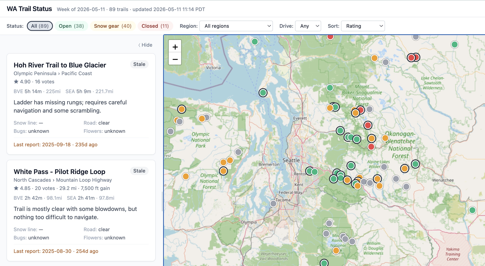

# wa-trail-guide

Local weekly dashboard summarizing the top hiking trails in Washington State from WTA trip reports. Cards on the left, sticky map on the right. Filter by accessibility (Open / Snow gear / Closed), region, and driving time from Seattle/Bellevue. Runs weekly via launchd (macOS) or any cron, served at `http://localhost:8765`.



> Personal weekly trail-status tool. Scrapes [wta.org](https://www.wta.org/) (1 req/sec, identified UA), routes via [public OSRM](https://router.project-osrm.org/), summarizes via OpenAI GPT-4o-mini, renders a single-file static dashboard.

## Architecture

Five-step pipeline. Each step reads the previous step's JSON and writes its own — debuggable in isolation, re-runnable independently.

```
scrape_trails.py  → data/trails.json       (top-N per region + curated extras + coords)
compute_drive.py  → data/drive_cache.json  (OSRM driving times, keyed by lat/lng)
scrape_reports.py → data/reports.json      (last 3 trip reports per trail)
summarize.py      → data/status.json       (GPT-4o-mini structured: accessibility, summary, ...)
render.py         → dist/index.html        (Jinja2 → Tailwind + Alpine + Leaflet)
```

## Source files

| File | Purpose |
|---|---|
| `src/common.py` | Shared HTTP client (1 req/sec, real UA), region UUID table, paths |
| `src/scrape_trails.py` | Plone hike search per region + curated extras + JSON-LD coord extraction |
| `src/compute_drive.py` | OSRM driving time/distance from Seattle + Bellevue |
| `src/scrape_reports.py` | Per-trail trip reports parser (`/@@related_tripreport_listing`) |
| `src/summarize.py` | OpenAI tool-use → structured status |
| `src/render.py` | Merges artifacts; computes stale/fresh flags; renders HTML |
| `templates/dashboard.html.j2` | Tailwind + Alpine.js + Leaflet single-page UI |
| `run.sh` | Pipeline driver (chains the five steps via uv) |
| `launchd/*.plist` | Weekly cron + always-on local HTTP server |

## Data files

| File | Description |
|---|---|
| `data/trails.json` | Per trail: slug, name, region/subregion, rating, votes, length, elevation, lat/lng, drive_seattle_min, drive_bellevue_min |
| `data/extra_trails.json` | Curated WTA slugs to include beyond regional top-N. Edit this to add/remove trails. |
| `data/reports.json` | Latest 3 trip reports per trail (date, author, body, feature flags, "Beware of") |
| `data/status.json` | GPT-derived per trail: accessibility, accessibility_reason, snow_line_ft, road_status, bugs, wildflowers, summary, last_report_date, _cache_sig |
| `data/drive_cache.json` | OSRM cache keyed by `"{lat:.5f},{lng:.5f}"` → `{seattle_min, seattle_mi, bellevue_min, bellevue_mi}` |

## Features

- **Accessibility filter** — Open / Snow gear / Closed / All, with live counts
- **Region select** — 11 WTA regions
- **Drive-time filter** — Any / ≤1h / ≤2h / ≤3h / ≤4h / ≤5h, using `min(seattle_min, bellevue_min)`
- **Sort** — Rating · Most recent · Drive time · Volume · Name
- **Map** (OpenStreetMap + Leaflet)
  - Marker color = accessibility (green/amber/red); gray = stale
  - Bold dark ring = report within 7 days
  - Click marker → popup with status, summary, link
- **Layout** — cards left, map right (sticky, fills viewport); compact one-line header + single-row filter bar
- **Resize / collapse** — drag the 2-px gutter between panes; "⟨ Hide" collapses cards to give the map full width; state persists in localStorage (`wta-status:left-width`, `wta-status:collapsed`)
- **Mobile** — stacks vertically with map on top

## Weekly refresh

Two launchd agents:
- `com.lifidea.wta-status` — Friday 06:00 PT, runs `run.sh` once
- `com.lifidea.wta-status-server` — always-on, serves `dist/` at `:8765` via `python -m http.server`

Per-refresh cost on a warm cache:
- WTA scraping: ~100 page fetches at 1 req/sec → ~100 s
- OSRM driving: ~5 s (all coords cached after week 1)
- OpenAI: ~10-30 calls at ~$0.0005 each → ~$0.01 (only trails with new reports re-summarized)
- Total wall time: ~2 min warm, ~3-4 min cold

## Setup

Requires [`uv`](https://docs.astral.sh/uv/) and Python 3.11+. An OpenAI API key (`OPENAI_API_KEY`) in the shell env or `.env`.

```bash
git clone https://github.com/jykim/wa-trail-guide.git
cd wa-trail-guide
uv sync
cp .env.example .env   # add OPENAI_API_KEY (or rely on shell env)
./run.sh               # ~3-4 min cold run, ~$0.02 OpenAI cost
open http://localhost:8765
```

### Optional: install launchd agents for weekly refresh (macOS)

The plists in `launchd/` hardcode an absolute path (`/Users/lifidea/Vaults/OVM/_Sandbox_/wta-status`). Update them to your clone path first, then:

```bash
# Substitute your path
PROJECT_DIR="$(pwd)"
sed -i '' "s|/Users/lifidea/Vaults/OVM/_Sandbox_/wta-status|$PROJECT_DIR|g" launchd/*.plist

cp launchd/com.lifidea.wta-status.plist        ~/Library/LaunchAgents/
cp launchd/com.lifidea.wta-status-server.plist ~/Library/LaunchAgents/
launchctl bootstrap gui/$(id -u) ~/Library/LaunchAgents/com.lifidea.wta-status-server.plist
launchctl bootstrap gui/$(id -u) ~/Library/LaunchAgents/com.lifidea.wta-status.plist

# Trigger a one-off scheduled run to verify
launchctl kickstart -k gui/$(id -u)/com.lifidea.wta-status
```

Uninstall: `launchctl bootout gui/$(id -u)/com.lifidea.wta-status{,-server}`.

On Linux/other, any cron + a simple HTTP server works — `run.sh` is portable bash.

## Customizing the trail list

The dashboard pulls from two sources:

1. **Regional top-N** (automatic): `scrape_trails.py` walks WTA's 11 regions, takes top `PER_REGION_KEEP=5` rated trails with `MIN_RATING=4` and `MIN_VOTES=20`. Tune constants at the top of `src/scrape_trails.py`.
2. **Curated extras** (manual): `data/extra_trails.json`. Add entries like:
   ```json
   [
     {"slug": "lake-22-lake-twenty-two", "url": "https://www.wta.org/go-hiking/hikes/lake-22-lake-twenty-two"}
   ]
   ```
   The scraper fetches each slug's trail page and merges into `trails.json`, deduped by slug.

## Efficiency

### Implemented caches

- **Coord cache** — `scrape_trails.py` reads the previous `trails.json` and reuses `lat`/`lng` if the slug already had them. Skips ~89 trail-page fetches per weekly run.
- **Curated extras cache** — known extras are rehydrated from prior `trails.json` instead of re-fetched. Only brand-new extras hit WTA.
- **Drive cache** — `compute_drive.py` keys by `(lat, lng)` and persists to `drive_cache.json`. Coords don't change, so this is effectively forever-cached.
- **Summary cache** — `summarize.py` writes `_cache_sig = "v2::{latest_report_url}"` on each status entry. Next run skips the OpenAI call if the latest report URL hasn't changed. Bump `PROMPT_VERSION` to invalidate when tweaking the system prompt.
- **Throttled, identified scraping** — 1 req/sec to WTA, ~2 req/sec to OSRM, with a `wta-status/0.1 (personal weekly dashboard)` User-Agent.

### Future improvements (not implemented)

- **HTTP conditional requests** — WTA is behind Varnish + Cloudflare; many endpoints support `Last-Modified` / `ETag`. Wrapping `requests` with [`requests-cache`](https://pypi.org/project/requests-cache/) (304 handling) could skip unchanged regional search pages without re-parsing.
- **Region scrape cadence split** — top-trail rankings change slowly. Run region search monthly, reports + summarize weekly. Cuts WTA weekly traffic ~25%.
- **OpenAI prompt caching** — the static ~600-token system prompt is sent 89 times per cold run. OpenAI's [prompt caching](https://platform.openai.com/docs/guides/prompt-caching) discounts 50% on cached tokens; switch the system block to a cacheable format to save ~$0.01 per cold run.
- **Report-listing short-circuit** — `scrape_reports.py` fetches the listing page even when its top entry hasn't changed. If WTA exposes a `Last-Modified` header on the listing endpoint, a HEAD request could skip the GET.
- **Incremental render** — serve a static HTML shell once + load `data.json` via `fetch` so updates are diff-friendly rather than rewriting a 90KB file. Useful only if you start scripting on top of the dashboard.
- **Batch OpenAI** — send 10-20 trails per request. Cheaper amortized; trade-off is harder debugging and longer per-call latency.

## Verification

After a refresh:
```bash
python3 - <<'PY'
import json
trails = json.load(open('data/trails.json'))
status = json.load(open('data/status.json'))
reports = json.load(open('data/reports.json'))
print(f"trails:  {len(trails)}")
print(f"reports: {sum(len(v) for v in reports.values())}")
print(f"status:  {len(status)}  (cache hits next run: {sum(1 for v in status.values() if v.get('_cache_sig'))})")
PY
```

Then open `http://localhost:8765` and confirm:
1. Map shows ~89 colored markers across WA state
2. Status filter pills swap the visible card set + marker set
3. Drive-time select narrows to the picked time bucket without shifting marker positions
4. Resize/collapse handle works and reload preserves your width

## Notes

- Personal use. Throttled scraping with an identifying User-Agent. Don't redistribute scraped report content.
- Status classification by GPT-4o-mini — not life-safety advice. Always read the linked WTA reports before going.
- OSRM public profile doesn't include ferries; Whidbey/Olympic Peninsula drive times are conservative (e.g. Ebey's Landing shows ~140 min via Deception Pass vs. ~90 min via Mukilteo ferry).
